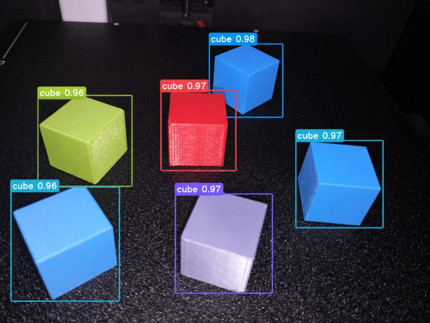
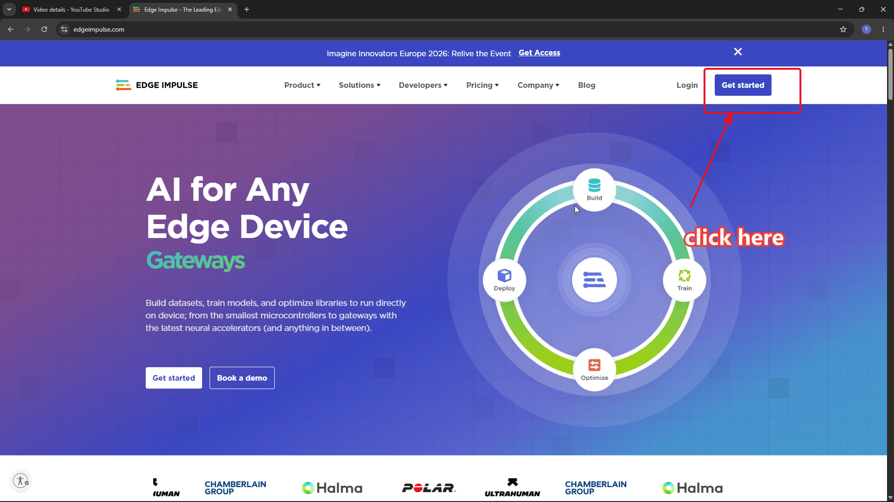
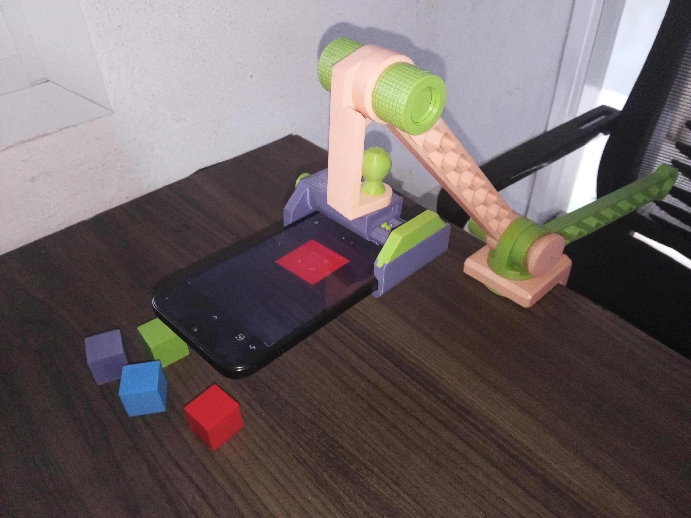
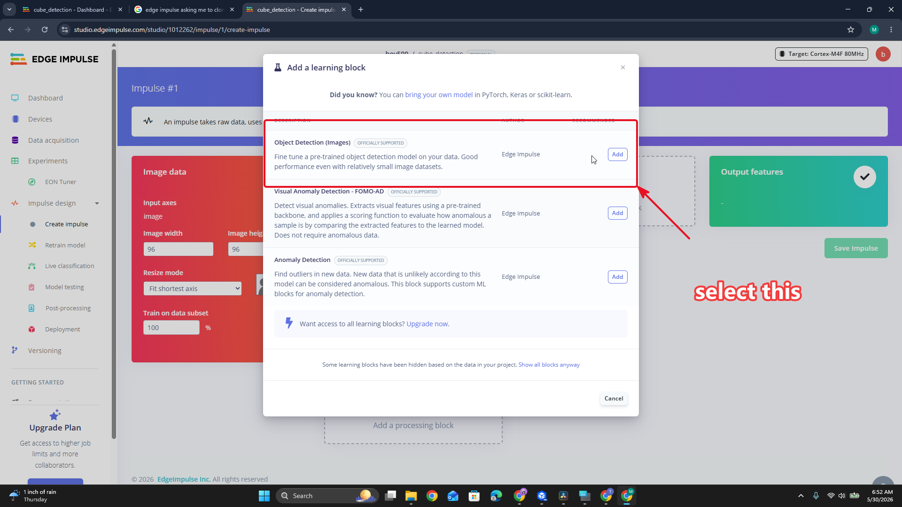
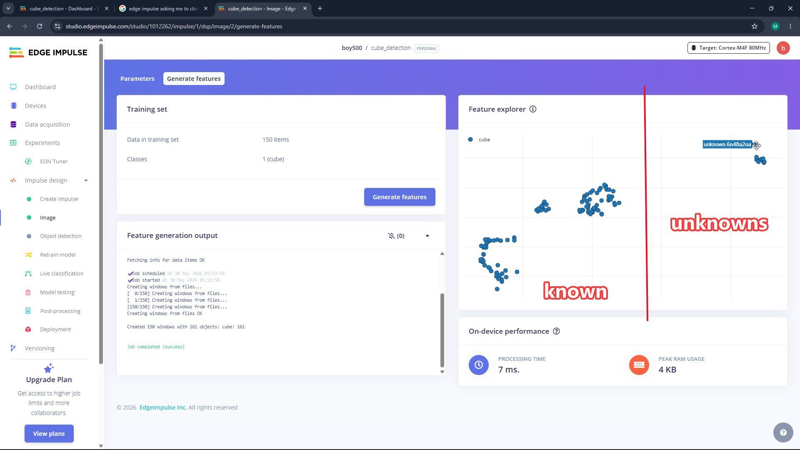
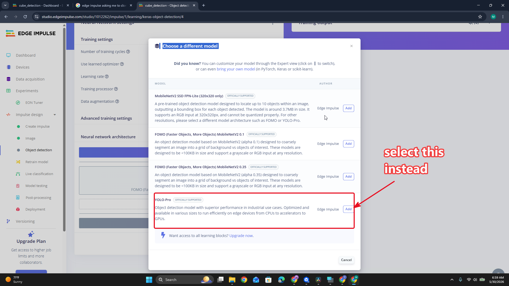
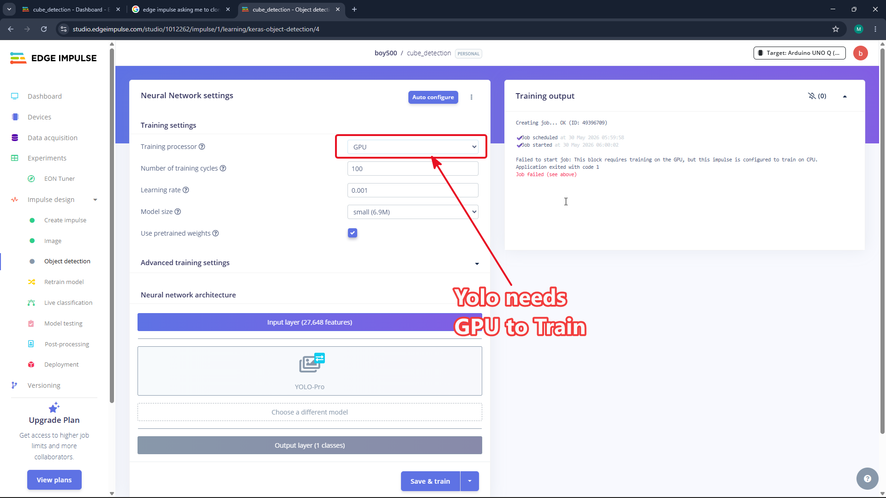
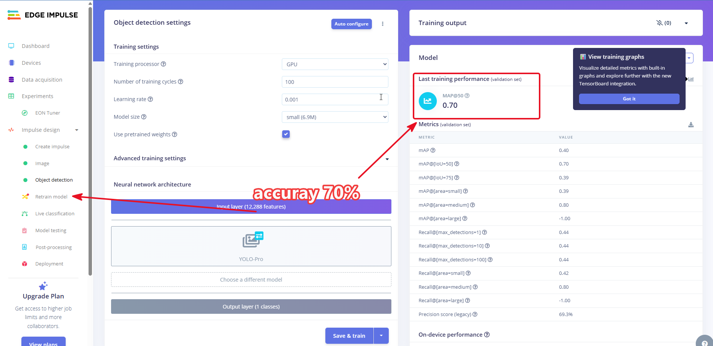

# 🤖 Pick & Place: Edge Impulse AI Cube Detection for Robotic Arm

<div align="center">



### **Train and Deploy an Edge Impulse YOLO Pro Object Localization Model for Robotic Arm Cube Pick & Place**

[](https://www.edgeimpulse.com/)
[-00599C?style=for-the-badge)](https://www.edgeimpulse.com/)
[](https://hwivc.org)
[](https://github.com/TheAfricanJiant/Practical-C-)
[](https://hwivc.org/blog/how-to-train-and-test-an-ai-model-on-edge-impulse)

---

**An end-to-end Edge AI vision pipeline built to empower a robotic arm to identify, localize, pick, and place colored cubes.**

[📖 Read Original Blog Tutorial](https://hwivc.org/blog/how-to-train-and-test-an-ai-model-on-edge-impulse) • [📹 Watch YouTube Video Tutorials](#-video-tutorials--demos) • [🦾 Practical C++ Hardware Masterclass](https://github.com/TheAfricanJiant/Practical-C-) • [📦 Download Project Datasets](#-datasets--resources)

</div>

---

## 📋 Table of Contents
- [✨ Project Overview](#-project-overview)
- [🦾 Hardware Prerequisites: Practical C++ Masterclass](#-hardware-prerequisites-practical-c-masterclass)
- [🧠 What is an AI Model? (Intuitive Mental Model)](#-what-is-an-ai-model-intuitive-mental-model)
- [📹 Video Tutorials & Demos](#-video-tutorials--demos)
- [🛠️ Step-by-Step Training Guide](#️-step-by-step-training-guide)
  - [1. Account & Project Initialization](#1-account--project-initialization)
  - [2. Hardware Setup & Stable Data Capture](#2-hardware-setup--stable-data-capture)
  - [3. Impulse Design & Bounding Box Configuration](#3-impulse-design--bounding-box-configuration)
  - [4. Model Selection & GPU Training](#4-model-selection--gpu-training)
- [📊 Performance & Results](#-performance--results)
- [💡 Pro-Tips for Maximizing Accuracy](#-pro-tips-for-maximizing-accuracy)
- [🦾 Robotic Arm Integration & Next Steps](#-robotic-arm-integration--next-steps)
- [📦 Datasets & Resources](#-datasets--resources)

---

## ✨ Project Overview

This repository contains the complete dataset, model configuration, export files, and documentation for building a custom **Edge Impulse Object Localization AI Model** designed to run on resource-constrained embedded systems and robotic platforms. 

Using **YOLO Pro** object detection, the system identifies 3D-printed cubes of varying colors under an overhead camera feed, providing exact bounding box spatial coordinates $(x, y, w, h)$ to a robotic arm controller running Forward and Inverse Kinematics algorithms.

```
       ┌───────────────────────────────────────────────────────────┐
       │                 PICK & PLACE AI PIPELINE                  │
       │                                                           │
       │  ┌──────────────────┐    ┌─────────────────────────────┐  │
       │  │ Camera Data      │───►│ Edge Impulse YOLO Pro Model │  │
       │  │ Image (96x96)    │    │ Bounding Box Localization   │  │
       │  └──────────────────┘    └──────────────┬──────────────┘  │
       └─────────────────────────────────────────┼─────────────────┘
                                                 │
                                                 ▼ Coordinates (x, y)
                              ┌───────────────────────────────────┐
                              │  ROBOTIC ARM KINEMATICS           │
                              │  • Inverse Kinematics Solver      │
                              │  • Servo Pick & Place Motion      │
                              └───────────────────────────────────┘
```

---

## 🦾 Hardware Prerequisites: Practical C++ Masterclass

Before deploying computer vision models to control a physical robot arm, you need a strong understanding of robotic arm hardware, servo control, and firmware architecture.

> [!IMPORTANT]
> 🔗 **Start Here First:** [**Practical C++ — BraccioV2 Masterclass Repository**](https://github.com/TheAfricanJiant/Practical-C-)
> 
> The **Practical C++** repository is the foundational prerequisite to study the basic hardware and firmware of the robotic arm. It offers a 20-lesson masterclass covering:
> - **Lesson 01–07:** C++ basics, toolchains, headers, and preprocessor macros.
> - **Lesson 08–11:** Object-Oriented Programming (OOP) modeling 6-joint robotic arms.
> - **Lesson 12–15:** Memory safety, pointers, references, and joint arrays.
> - **Lesson 16–20:** Building your own custom Arduino `MyBraccio` servo control library from scratch.

---

## 🧠 What is an AI Model? (Intuitive Mental Model)

To understand how Edge Impulse processes camera frames, imagine teaching a young child to recognize objects:

1. **Exposure (Training):** You show the child hundreds of pictures containing *only* cats so they learn the repeating patterns.
2. **Generalization (Validation):** You show new pictures with cats of different colors, shapes, or angles, along with non-cat objects, testing if they can distinguish them.
3. **Localization (Bounding Boxes):** You present a scene with multiple objects and ask the child to point directly to each cat.

> 💡 **Key Concept:** An AI model is a mathematical formula (blueprint) containing **weights** learned during training. During live usage (**inferencing**), the model compares fresh camera inputs against these stored weights to predict object classes and bounding box coordinates in real time.

---

## 📹 Video Tutorials & Demos

| Tutorial Video | Description | Watch Link |
| :--- | :--- | :---: |
| **1. Project Creation & Dataset Setup** | Setting up `cube_detection` on Edge Impulse and capturing camera samples. | [<br>▶️ Watch Video](https://www.youtube.com/watch?v=Kr2A7BE8i8M) |
| **2. Bounding Box Annotation & Labelling** | Drawing precise bounding boxes around cubes in the Edge Impulse Studio. | [<br>▶️ Watch Video](https://www.youtube.com/watch?v=ve-P7q4KRGE) |
| **3. Live Model Inferencing & Demonstration** | Testing the trained model on live webcam camera stream with bounding boxes. | [<br>▶️ Watch Video](https://www.youtube.com/watch?v=k00gGfNA90Y) |

---

## 🛠️ Step-by-Step Training Guide

### 1. Account & Project Initialization
Create a free account on [Edge Impulse](https://www.edgeimpulse.com/) and create a new project named **`cube_detection`**.

<div align="center">

| Step A: Register Account | Step B: Project Dashboard |
| :---: | :---: |
|  |  |

</div>

---

### 2. Hardware Setup & Stable Data Capture
A stable data acquisition platform is critical for high object recognition accuracy. Mounting your camera on a rigid tripod or fixed overhead mount avoids perspective distortion.



---

### 3. Impulse Design & Bounding Box Configuration
1. Navigate to **Create Impulse**.
2. Set Image Dimensions to **`96 x 96`**.
3. Add the **Image** processing block and **Object Detection (Images)** learning block.



4. Move to the **Object Detection** tab and save image parameters. The generated Feature Explorer clearly separates `cube` clusters from unknown background noise:



---

### 4. Model Selection & GPU Training
1. Select **YOLO Pro** as the object detection architecture to output bounding box coordinates $(x, y, w, h)$.
2. **Crucial:** Ensure the training target hardware is set to **GPU** to prevent compute timeouts during neural network optimization.

<div align="center">

| Architecture: YOLO Pro | Training Engine: GPU Acceleration |
| :---: | :---: |
|  |  |

</div>

---

## 📊 Performance & Results

The initial baseline training achieved **70% validation precision** on the first training epoch:



### Model Specs
- **Input Resolution:** $96 \times 96$ RGB
- **Model Type:** Object Localization (YOLO Pro)
- **Target Classes:** `cube`
- **Output:** Class probabilities + Bounding Box offsets $(x, y, \text{width}, \text{height})$

---

## 💡 Pro-Tips for Maximizing Accuracy

> [!TIP]
> **1. Label Every Single Object**  
> If an image contains 3 cubes and you only label 2, the model treats the 3rd unlabeled cube as background noise! Unlabelled targets severely penalize model precision.

> [!IMPORTANT]
> **2. Capture Background Negative Samples**  
> Always include images of the empty table/workstation without any cubes present. This teaches the model: *"The surface is here, but no object is present."*

---

## 🦾 Robotic Arm Integration & Next Steps

Once inferencing yields real-time coordinates, the camera feeds $(x, y)$ pixels to the robot arm controller:

1. **Pixel-to-World Calibration:** Converts image pixel coordinates $(x, y)$ to real-world metric coordinates $(X_{\text{mm}}, Y_{\text{mm}}, Z_{\text{mm}})$.
2. **Inverse Kinematics (IK):** Calculates joint angles $(\theta_1, \theta_2, \theta_3, \theta_4)$ required for the end-effector gripper to descend.
3. **Pick and Place Execution:** Gripper closes on the detected cube, raises, moves to the target drop area, and releases.
4. **Hardware Driver Integration:** Pairs with the custom `MyBraccio` C++ driver developed in [**Practical C++**](https://github.com/TheAfricanJiant/Practical-C-).

---

## 📦 Datasets & Resources

- **Prerequisite C++ Hardware Course:** [Practical C++ — BraccioV2 Masterclass](https://github.com/TheAfricanJiant/Practical-C-)
- **Original Tutorial Blog:** [HWIVC - How to Train and Test an AI Model on Edge Impulse](https://hwivc.org/blog/how-to-train-and-test-an-ai-model-on-edge-impulse)
- **3D Modeling & Printing Guide:** [3D Modelling & Printing Step-by-Step](https://hwivc.org/blog/3d-modelling-printing-step-by-step)
- **Local Assignment Files:** [`assignment.zip`](assignment.zip)
- **Local Edge Impulse Export:** [`cube-detection-export.zip`](cube-detection-export.zip)

---

<div align="center">

*Empowering embedded systems and robotics through accessible Edge AI vision.*

</div>
